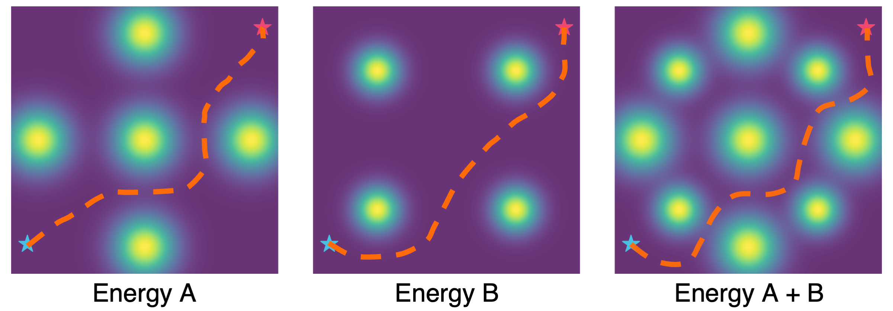
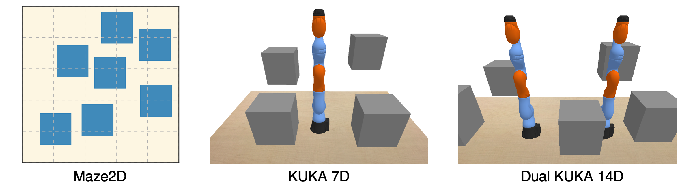

# Potential Based Diffusion Motion Planning

[[Project page]](https://energy-based-model.github.io/potential-motion-plan/)
[[Paper]](https://arxiv.org/abs/2407.06169)
[![][colab]][maze2d-eval-demo]
<!-- [[Data]]() -->
<!-- [Colab]() -->
<!-- declare varibles -->
[colab]: <https://colab.research.google.com/assets/colab-badge.svg>
[maze2d-eval-demo]: <https://colab.research.google.com/drive/1pARD89PfSzF3Ml6virZjztEJKWhXVkBY?usp=sharing>


[Yunhao Luo](https://devinluo27.github.io/)<sup>1</sup>,
[Chen Sun](https://chensun.me/)<sup>1</sup>,
[Joshua B. Tenenbaum](https://web.mit.edu/cocosci/josh.html)<sup>2</sup>,
[Yilun Du](https://yilundu.github.io/)<sup>2</sup>


<sup>1</sup>Brown University,
<sup>2</sup>MIT

This is the official codebase for Potential Based Diffusion Motion Planning [ICML 2024].


<p align="center">
  
</p>

<p align="center">
  
</p>

**Potential Based Diffusion Motion Planning and Generalization.** Our approach learns different potential functions over motion planning trajectories. In test time, different potentials can be directly combined and optimized to construct new motion plans. Our method directly generalizes to cluttered heterogeneous environments (right two) via composing potentials, while the potential functions are only trained on simple homogeneous environments (left two).


## 🛝 Try it out!
We provide a Google Colab notebook [![][colab]][maze2d-eval-demo] for the Maze2D enviornments.  In this notebook, you can enter your own obstacle locations and set the agent's start/goal positions, and use the pre-trained model to generate motion plans. Additional jupyter notebook demos can be found in the `examples` directory.
<!-- Check out our Google Colab notebooks for motion plan generation here. -->


## 🛠️ Installation
The following guidance should work well for a machine with 3090/A5000/A6000 GPU, cuda 11.8. Our machine is installed with Red Hat Enterprise Linux v9.2 and loads the following modules:
```
1) zlib; 2) cuda/11.8.0; 3) git-lfs; 4) expat; 5) mesa/22.1.6; 6) libiconv; 7) ffmpeg;
```
For some other Linux versions, the equivalent modules might be required. 

Please follow the steps below to create a conda environment to reproduce our simulation benchmark results.

1. Create a python env.
```console
conda create -n pb_diff python=3.9
```

2. Install torch. Please checkout the `install_torch.sh` file and use the configuration that matches your system, e.g., cuda version.
```console
sh ./install_torch.sh
```

3. Install other packages in `requirements.txt`.
```console
pip install -r requirements.txt
```

4. Install the environment directory `pb_diff_envs`.
```console
cd pb_diff_envs && pip install -e . && cd ..
```


<!-- 📦 🗃️ 📥 🗂️-->
## 🗃️ Prepare Data for Enviornments


<p align="center">
  
</p>


Please visit this OneDrive [folder](https://1drv.ms/f/c/b25b9b5879968c8a/EnT53j8Q9K1OntGtVnNbhvYBPY4Mg09QJeTjKiMpkx3_Jw) for pre-generated training data and evalution problems. Please move the downloaded `.zip` file to `pb_diff_envs/pb_diff_envs` folder and unzip it. For example, for maze2D-static1-base environment, run
```console
cd pb_diff_envs/pb_diff_envs && unzip maze2d-static1-base.zip -d .
```
This command will create multiple files under the `datasets` folder. You can also generate your own dataset using the scripts in `pb_diff_envs`.


<!-- | [Maze2D Static 1]()   | Header 2    | [DualKuka Base](https://1drv.ms/f/c/b25b9b5879968c8a/EnT53j8Q9K1OntGtVnNbhvYBPY4Mg09QJeTjKiMpkx3_Jw)   | Header 4    |
|-------------|-------------|-------------|-------------|
| Row 1 Col 1 | Row 1 Col 2 | Row 1 Col 3 | Row 1 Col 4 | -->


## 📊 Using Pretrained Models

<!-- ### Downloading weights
```console
sh ./scripts/download_pretrained.sh
``` 
This command downloads and extracts a zip file containing [this directory]() to `logs/`.
-->
### Downloading weights
We provide links to pre-trained models below, as well as their corresponding config files in this repo. All files are hosted under this OneDrive [folder](https://1drv.ms/f/c/b25b9b5879968c8a/EmLj7rUt_oxFoSagujC4Bl4Bl7JymAHPVuU1tiLafmHOew).
| Model | Link | Config
| :---: | :---: | :---: |
| Maze2D Static 1 | [Link](https://1drv.ms/f/c/b25b9b5879968c8a/EmLj7rUt_oxFoSagujC4Bl4Bl7JymAHPVuU1tiLafmHOew) | `rm2d/rSmaze_nw6_hExt05_exp.py`
| Maze2D Static 2 | [Link](https://1drv.ms/f/c/b25b9b5879968c8a/EmLj7rUt_oxFoSagujC4Bl4Bl7JymAHPVuU1tiLafmHOew) | `rm2d/rSmaze_nw3_hExt07_exp.py`
| Maze2D Concave | [Link](https://1drv.ms/f/c/b25b9b5879968c8a/EmLj7rUt_oxFoSagujC4Bl4Bl7JymAHPVuU1tiLafmHOew) | `rm2d/rSmazeC43_concave_nw7_exp.py`
| Maze2D Dynamic | [Link](https://1drv.ms/f/c/b25b9b5879968c8a/EmLj7rUt_oxFoSagujC4Bl4Bl7JymAHPVuU1tiLafmHOew) | `rm2d/DynrSmaze_nw1_hExt10_exp.py`
| Kuka  | [Link](https://1drv.ms/f/c/b25b9b5879968c8a/EmLj7rUt_oxFoSagujC4Bl4Bl7JymAHPVuU1tiLafmHOew) | `kuka7d/kuka_exp.py`
| Dual Kuka | [Link](https://1drv.ms/f/c/b25b9b5879968c8a/EmLj7rUt_oxFoSagujC4Bl4Bl7JymAHPVuU1tiLafmHOew) | `dualk14/dualk14_exp.py`

You need to put the downloaded zip files in the root directory of this repo and unzip them, so that the created files can be in proper relative locations.
These model related files will be under the `logs` folder, which is organized roughly according to the following structure (some additional prefix and postfix might be added):
```
└── logs
    ├── ${environment_1}
    │   ├── diffusion
    │   │   └── ${experiment_name}
    │   │       ├── state_${iter}.pt
    │   │       └── {dataset, diffusion, model, render, trainer}_config.pkl
    │   └── plans
    │       └── ${experiment_name}
    │           ├── 0
    │               ├── {experiment_time:%y%m%d-%H%M%S}
    │               ├── ...
    │
    ├── ${environment_2}
    │   └── ...
```

The `state_${iter}.pt` files contain the network weights and the `{}_config.pkl` files contain the instantation arguments for the relevant classes. 

<!-- 
For example,
```console
[potential-motion-plan-release]$ unzip .zip -d .
``` -->

 <!-- and placed them in appropriate directory,  -->
### Planning
After you have downloaded both the environment data and model weights, you can launch motion planning using the given scripts below. 
Before run, you should set the `$config` varibale in the script, which should be the relative path to a config file (see the scripts for examples).

For Maze2D environments, run:
```console
./plan_rm2d.sh $1 $2
```
For Kuka and Dual Kuka, run:
```console
./plan_kuka.sh $1 $2
```
<!-- You can specifiy -->
Please replace `$1` by  how many different environments to evaluate on and `$2` by a GPU index. 

### Jupyter Notebook Examples
To help you better understand and use the codebase, we provide multiple jupyter notebooks under `examples` folder, where you can generate motion plans and visualize them interactively. Feel free to try them out. If missing files are reported, please download the corresponding files from the OneDrive link above. 


<!-- 💻 -->
## 🕹️ Train a Model
With the environment data downloaded, you can directly train your own model. We notice that it might take several minutes for the dataset preprocessing, so we provide a smaller *testOnly* version dataset for debugging purposes. To launch the training, run
```console
sh train_pb_diff.sh
```
Similarly, you can change the `$config` variable to launch different experiments. When customizing your own config, we suggest you start with *testOnly* dataset for faster loading, and then switch to full size dataset.


<!-- ======================= -->

<!-- ## 🔩 Key Components -->

## ➕ Add an Experiment
We create a new config file under the `config` folder for a new experiment. Each experiment will create a new folder under `logs`. Please read and imitate existing config files. 


## 🏷️ License
This repository is released under the MIT license. See [LICENSE](LICENSE) for additional details.


## 🙏 Acknowledgement
* The implementation of Kuka and Dual Kuka simulation environments and several sampling-based motion planners are adapted from [lemp](https://github.com/aaucsd/lemp.git).
* Our model backbone is developed based on [Planning with Diffusion](https://github.com/jannerm/diffuser)
and 
[Reduce Reuse Recycle](https://github.com/yilundu/reduce_reuse_recycle).

Contact [Yunhao Luo](https://devinluo27.github.io/) if you have any questions or suggestions.


## 📝 Citations
If you find our work useful, please consider citing:
```
 @inproceedings{
    luo2024potential,
    title={Potential Based Diffusion Motion Planning},
    author={Yunhao Luo and Chen Sun and Joshua B. Tenenbaum and Yilun Du},
    booktitle={Forty-first International Conference on Machine Learning},
    year={2024},
  }
```